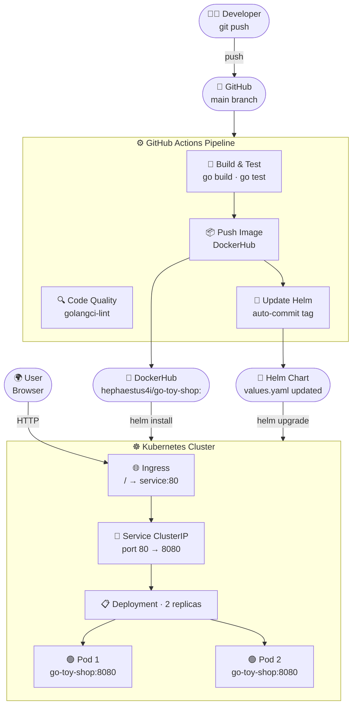

<div align="center">

# 🧸 Go Toy Shop

**A production-grade Go web app with full DevOps pipeline**

[](https://golang.org)
[](https://hub.docker.com/r/hephaestus4i/go-toy-shop)
[](https://kubernetes.io)
[](https://github.com/Amands123/go-toy-shop-app/actions)

</div>

---

## 🏗️ Architecture



---

## 🚀 Quick Start

```bash
# Clone
git clone https://github.com/Amands123/go-toy-shop-app.git
cd go-toy-shop-app

# Run
go mod tidy
go run main.go
# → http://localhost:8080
```

---

## 🐳 Docker

```bash
# Build
docker build -t go-toy-shop:local .

# Run
docker run -p 8080:8080 go-toy-shop:local
```

> Multi-stage build: `golang:1.24` → `gcr.io/distroless/base` (minimal attack surface)

---

## ☸️ Kubernetes

```bash
# Apply raw manifests
kubectl apply -f k8s/manifests/

# Verify
kubectl get pods,svc,ingress -l app=go-toy-shop
```

---

## ⛵ Helm

```bash
# Install
helm install go-toy-shop ./helm/go-toy-shop-chart

# Upgrade with a new image tag
helm upgrade go-toy-shop ./helm/go-toy-shop-chart --set image.tag=<run_id>

# Scale replicas
helm upgrade go-toy-shop ./helm/go-toy-shop-chart --set replicaCount=3

# Uninstall
helm uninstall go-toy-shop
```

---

## ⚙️ CI/CD Pipeline

Triggered on every push to `main` (ignores `helm/`, `k8s/`, `README.md`)

| Job | Runs after | What it does |
|---|---|---|
| `build` | — | `go build` + `go test ./... -v` |
| `code-quality` | — | `golangci-lint` (parallel) |
| `push` | `build` | Docker build → DockerHub (tag = `${{ github.run_id }}`) |
| `update-newtag-in-helm-chart` | `push` | `sed` new tag into `values.yaml`, auto-commit |

**Required secrets:**

| Secret | Purpose |
|---|---|
| `DOCKERHUB_USERNAME` | DockerHub login |
| `DOCKERHUB_TOKEN` | DockerHub access token |
| `TOKEN` | GitHub PAT (repo write for auto-commit) |

---

## 🧪 Tests

```bash
go test ./... -v        # all tests
go test ./... -cover    # with coverage
```

---

## 📁 Structure

```
go-toy-shop-app/
├── main.go                    # HTTP server + routes
├── main_test.go               # Handler tests
├── handlers/handlers.go       # Business logic
├── templates/                 # HTML templates
├── static/                    # CSS + images
├── Dockerfile                 # Multi-stage build
├── k8s/manifests/             # deployment · service · ingress
├── helm/go-toy-shop-chart/    # Helm chart (replicas: 2)
└── .github/workflows/ci.yaml  # CI/CD pipeline
```

---

## 🛣️ Routes

| Method | Route | Description |
|---|---|---|
| GET | `/` | Home — toy categories |
| GET | `/toys?category=<name>` | Products by category |
| GET | `/add-to-cart?id=<id>` | Add to cart |
| GET | `/cart` | View cart |
| POST | `/place-order` | Place order |
| GET | `/about` | About |
| GET | `/contact` | Contact |

---

<div align="center">

Made with ❤️ by **[Aman Agarwal](https://github.com/Amands123)**

</div>
