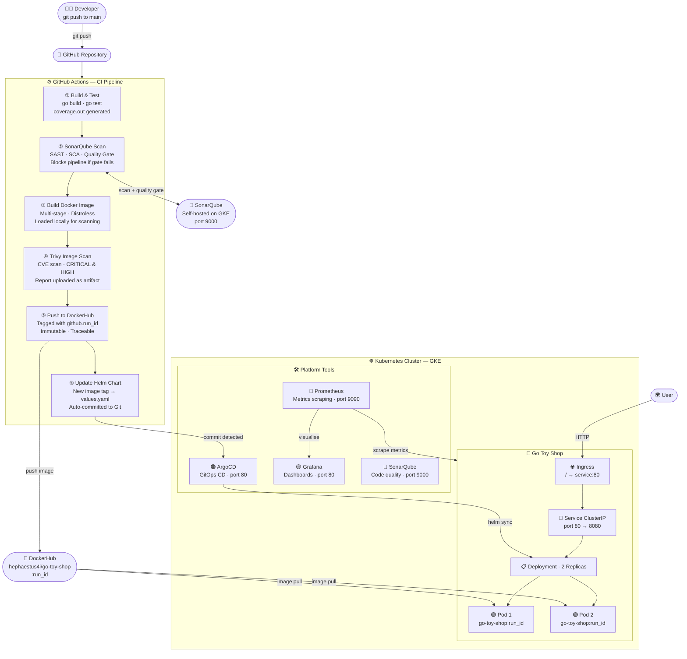

<div align="center">

# 🧸 Go Toy Shop


</div>

---

<div align="center">

## 🔐 Secure. Automated. Observable. Production-Ready.

</div>

> This project is not just about deploying an application.
> It is about building the **entire delivery system** around it —
> a system where code is automatically **tested**, **quality-checked**, **scanned for vulnerabilities**,
> **containerised**, **deployed without human intervention**, and **monitored in real time**.
>
> Every commit triggers a hardened pipeline that enforces security at three layers —
> source code, container image, and runtime infrastructure —
> before a single pod is updated on the cluster.
>
> This is **DevSecOps** done right.

---


<div align="center">

[](https://golang.org)
[](https://hub.docker.com/r/hephaestus4i/go-toy-shop)
[](https://kubernetes.io)
[](https://helm.sh)
[](https://github.com/Amands123/go-toy-shop-app/actions)
[](https://argo-cd.readthedocs.io)
[](https://www.sonarsource.com)
[](https://trivy.dev)
[](https://prometheus.io)
[](https://grafana.com)

</div>

---

## 📑 Table of Contents

- [Project Overview](#-project-overview)
- [DevSecOps Architecture](#-devsecops-architecture)
- [Project Structure](#-project-structure)
- [Security Layers](#-security-layers)
- [Prerequisites](#-prerequisites)
  - [Install ArgoCD](#-install-argocd)
  - [Install SonarQube](#-install-sonarqube)
  - [Install Prometheus + Grafana](#-install-prometheus--grafana)
- [CI Pipeline — GitHub Actions](#-ci-pipeline--github-actions)
- [CD Pipeline — ArgoCD](#-cd-pipeline--argocd)
- [Monitoring — Prometheus + Grafana](#-monitoring--prometheus--grafana)
- [Local Development](#-local-development)
- [Application Routes](#-application-routes)

---

## 🎯 Project Overview

| Layer | Tool | Purpose |
|---|---|---|
| **Application** | Go 1.24 | Lightweight stateless web app |
| **Containerisation** | Docker + Distroless | Minimal, secure runtime image |
| **CI Pipeline** | GitHub Actions | Automates build, test, scan, push |
| **Code Quality** | SonarQube (self-hosted) | SAST, SCA, coverage, quality gate |
| **Image Security** | Trivy | Scans Docker image for CVEs |
| **Image Registry** | DockerHub | Stores versioned Docker images |
| **CD Pipeline** | ArgoCD | GitOps-based deployment to K8s |
| **Packaging** | Helm v3 | Kubernetes application packaging |
| **Orchestration** | Kubernetes (GKE) | Container runtime & scaling |
| **Monitoring** | Prometheus + Grafana | Metrics collection & dashboards |

---

## 🏗️ DevSecOps Architecture


```mermaid

flowchart TD
    DEV(["👨‍💻 Developer\ngit push to main"])
    GH(["🐙 GitHub Repository"])
    DEV -->|git push| GH

    subgraph CI ["⚙️ GitHub Actions — CI Pipeline"]
        direction TB
        A["① Build & Test\ngo build · go test\ncoverage.out generated"]
        B["② SonarQube Scan\nSAST · SCA · Quality Gate\nBlocks pipeline if gate fails"]
        C["③ Build Docker Image\nMulti-stage · Distroless\nLoaded locally for scanning"]
        D["④ Trivy Image Scan\nCVE scan · CRITICAL & HIGH\nReport uploaded as artifact"]
        E["⑤ Push to DockerHub\nTagged with github.run_id\nImmutable · Traceable"]
        F["⑥ Update Helm Chart\nNew image tag → values.yaml\nAuto-committed to Git"]
        A --> B --> C --> D --> E --> F
    end

    GH --> CI

    SQ(["🔵 SonarQube\nSelf-hosted on GKE\nport 9000"])
    DH(["🐋 DockerHub\nhephaestus4i/go-toy-shop\n:run_id"])

    B <-->|scan + quality gate| SQ
    E -->|push image| DH

    subgraph K8S ["☸️ Kubernetes Cluster — GKE"]
        direction TB

        subgraph TOOLS ["🛠️ Platform Tools"]
            ARGO["🟠 ArgoCD\nGitOps CD · port 80"]
            PROM["🔴 Prometheus\nMetrics scraping · port 9090"]
            GRAF["🟡 Grafana\nDashboards · port 80"]
            SQK["🔵 SonarQube\nCode quality · port 9000"]
            PROM -->|visualise| GRAF
        end

        subgraph APP ["🧸 Go Toy Shop"]
            ING["🌐 Ingress\n/ → service:80"]
            SVC["🔀 Service ClusterIP\nport 80 → 8080"]
            DEP["📋 Deployment · 2 Replicas"]
            P1["🟢 Pod 1\ngo-toy-shop:run_id"]
            P2["🟢 Pod 2\ngo-toy-shop:run_id"]
            ING --> SVC --> DEP --> P1 & P2
        end

        PROM -->|scrape metrics| APP
    end

    F -->|commit detected| ARGO
    ARGO -->|helm sync| DEP
    DH -->|image pull| P1 & P2

    USER(["🌍 User"]) -->|HTTP| ING
```

---

## 📁 Project Structure

```
go-toy-shop-app/
│
├── main.go                          # HTTP server & route registration
├── main_test.go                     # Handler tests
├── go.mod                           # Go module (v1.24)
│
├── handlers/
│   └── handlers.go                  # Request handlers & in-memory data
│
├── templates/                       # HTML templates
│   ├── home.html
│   ├── toys.html
│   ├── cart.html
│   ├── order-success.html
│   ├── about.html
│   └── contact.html
│
├── static/                          # CSS & images
│
├── Dockerfile                       # Multi-stage: golang:1.24 → distroless
├── sonar-project.properties         # SonarQube project config
│
├── helm/
│   └── go-toy-shop-chart/
│       ├── Chart.yaml
│       ├── values.yaml              # ← image.tag auto-updated by CI
│       └── templates/
│           ├── deployment.yaml
│           ├── service.yaml
│           └── ingress.yaml
│
├── k8s/manifests/                   # Raw Kubernetes manifests
│
└── .github/
    └── workflows/
        └── ci.yaml                  # GitHub Actions CI pipeline
```

---

## 🔐 Security Layers

```
Layer 1 — Source Code        SonarQube SAST/SCA
                              Scans Go code for vulnerabilities,
                              code smells, and security hotspots.
                              Quality Gate must PASS to proceed.
                                      ↓
Layer 2 — Container Image    Trivy CVE Scanner
                              Scans built Docker image for
                              OS and dependency vulnerabilities.
                              Report saved as pipeline artifact.
                                      ↓
Layer 3 — Runtime            Distroless Base Image
                              No shell. No package manager.
                              Minimal attack surface in production.
                                      ↓
Layer 4 — Config Drift       ArgoCD Self-Heal
                              Any manual cluster change is
                              automatically reverted to match Git.
```

---

## ✅ Prerequisites

| Requirement | Details |
|---|---|
| GKE Cluster | Must be running with `kubectl` configured |
| Helm v3 | Required for all tool installations |
| ArgoCD | Installed on cluster — see steps below |
| SonarQube | Installed on cluster — see steps below |
| Prometheus + Grafana | Installed on cluster — see steps below |

---

## 🟠 Install ArgoCD

```bash
# 1. Create namespace
kubectl create namespace argocd

# 2. Install ArgoCD
kubectl apply -n argocd -f https://raw.githubusercontent.com/argoproj/argo-cd/stable/manifests/install.yaml

# 3. Expose UI externally
kubectl patch svc argocd-server -n argocd -p '{"spec": {"type": "LoadBalancer"}}'

# 4. Get external IP
kubectl get svc argocd-server -n argocd

# 5. Get admin password
kubectl -n argocd get secret argocd-initial-admin-secret \
  -o jsonpath="{.data.password}" | base64 -d; echo
```

> 🌐 `http://<EXTERNAL-IP>` &nbsp;|&nbsp; Login: `admin` / `<password from step 5>`

### Connect ArgoCD to your repo

```yaml
# argocd-app.yaml
apiVersion: argoproj.io/v1alpha1
kind: Application
metadata:
  name: go-toy-shop
  namespace: argocd
spec:
  project: default
  source:
    repoURL: https://github.com/Amands123/go-toy-shop-app.git
    targetRevision: main
    path: helm/go-toy-shop-chart
  destination:
    server: https://kubernetes.default.svc
    namespace: default
  syncPolicy:
    automated:
      prune: true
      selfHeal: true
```

```bash
kubectl apply -f argocd-app.yaml
```

---

## 🔵 Install SonarQube

```bash
# 1. Create namespace
kubectl create namespace sonarqube

# 2. Add Helm repo
helm repo add sonarqube https://SonarSource.github.io/helm-chart-sonarqube
helm repo update

# 3. Install SonarQube Community Edition
helm install sonarqube sonarqube/sonarqube -n sonarqube \
  --set monitoringPasscode="admin123" \
  --set community.enabled=true

# 4. Wait until Running  (takes 2-3 mins due to Elasticsearch)
kubectl get pods -n sonarqube -w

# 5. Expose UI externally
kubectl patch svc sonarqube-sonarqube -n sonarqube -p '{"spec": {"type": "LoadBalancer"}}'

# 6. Get external IP
kubectl get svc sonarqube-sonarqube -n sonarqube
```

> 🌐 `http://<EXTERNAL-IP>:9000` &nbsp;|&nbsp; Login: `admin` / `admin`

### Generate token for CI

```
Login → My Account → Security → Generate Token → copy value
```

Add `sonar-project.properties` at repo root:

```properties
sonar.projectKey=go-toy-shop-app
sonar.projectName=Go Toy Shop
sonar.sources=.
sonar.exclusions=**/vendor/**,**/*_test.go
sonar.tests=.
sonar.test.inclusions=**/*_test.go
sonar.go.coverage.reportPaths=coverage.out
sonar.language=go
```

---

## 📊 Install Prometheus + Grafana

```bash
# 1. Create namespace
kubectl create namespace monitoring

# 2. Add Helm repo
helm repo add prometheus-community https://prometheus-community.github.io/helm-charts
helm repo update

# 3. Install kube-prometheus-stack (Prometheus + Grafana + Alertmanager)
helm install kube-prometheus-stack prometheus-community/kube-prometheus-stack \
  --namespace monitoring \
  --set grafana.adminPassword="admin123" \
  --set grafana.service.type=LoadBalancer \
  --set prometheus.prometheusSpec.retention=15d

# 4. Watch pods come up
kubectl get pods -n monitoring -w

# 5. Get Grafana external IP
kubectl get svc -n monitoring | grep grafana

# 6. Expose Prometheus externally (optional)
kubectl patch svc kube-prometheus-stack-prometheus -n monitoring \
  -p '{"spec": {"type": "LoadBalancer"}}'
kubectl get svc kube-prometheus-stack-prometheus -n monitoring
```

> 🌐 Grafana: `http://<EXTERNAL-IP>` &nbsp;|&nbsp; Login: `admin` / `admin123`
> 🌐 Prometheus: `http://<EXTERNAL-IP>:9090`

### Pre-built Grafana dashboards to import

```
Dashboards → Import → Enter ID → Load
```

| Dashboard | ID | Shows |
|---|---|---|
| Kubernetes Cluster | `7249` | Node CPU, memory, disk |
| Kubernetes Pods | `6417` | Per-pod resource usage |
| Kubernetes Deployments | `8588` | Deployment health & restarts |
| Go Application | `10826` | Go runtime metrics |

### Enable Prometheus scraping for your app

Add to `helm/go-toy-shop-chart/templates/deployment.yaml`:

```yaml
spec:
  template:
    metadata:
      annotations:
        prometheus.io/scrape: "true"
        prometheus.io/port: "8080"
        prometheus.io/path: "/metrics"
```

---

## ⚙️ CI Pipeline — GitHub Actions

> Triggered on every push to `main` — ignores `helm/`, `k8s/`, `README.md`

```
push to main
    │
    ▼
① build              go mod tidy → go build → go test → upload coverage.out
    │
    ▼
② code-quality       SonarQube SAST/SCA scan + Quality Gate
    │                 ✗ Gate fails → pipeline stops, nothing ships
    ▼
③ push               Build Docker image locally (push: false, load: true)
    │                 Trivy scans local image for CVEs
    │                 Report uploaded as artifact
    │                 Push clean image to DockerHub with :run_id tag
    ▼
④ update-helm        sed new image tag into helm/values.yaml
                      git commit & push → triggers ArgoCD sync
```

### Job dependency chain

| Job | Needs | Security gate |
|---|---|---|
| `build` | — | Tests must pass |
| `code-quality` | `build` | SonarQube quality gate must pass |
| `push` | `code-quality` | Trivy scan runs before push |
| `update-newtag-in-helm-chart` | `push` | Image must be scanned and pushed |

### Required GitHub Secrets

| Secret | Where to get it |
|---|---|
| `SONAR_TOKEN` | SonarQube → My Account → Security |
| `SONAR_HOST_URL` | `http://<sonarqube-external-ip>:9000` |
| `DOCKERHUB_USERNAME` | Your DockerHub username |
| `DOCKERHUB_TOKEN` | DockerHub → Account Settings → Security |
| `TOKEN` | GitHub → Settings → Developer Settings → PAT |

---

## 🔄 CD Pipeline — ArgoCD

> ArgoCD is the **only** CD mechanism. No `helm upgrade` in CI.

```
CI commits new image tag to helm/values.yaml
            │
            ▼
ArgoCD detects commit  (polls every 3 mins)
            │
            ▼
Runs helm sync → rolling update on cluster
            │
            ▼
New pods pull updated image from DockerHub
Old pods terminate after health checks pass
            │
            ▼
selfHeal: true → any manual cluster change
is automatically reverted to match Git
```

### Monitor deployments

```bash
kubectl get applications -n argocd
kubectl get pods -w
kubectl describe pod -l app=go-toy-shop | grep Image
```

---

## 📈 Monitoring — Prometheus + Grafana

```
Prometheus scrapes metrics from:
  ├── go-toy-shop pods      (app metrics on :8080/metrics)
  ├── Node Exporter         (CPU, memory, disk per node)
  ├── kube-state-metrics    (pod restarts, deployment health)
  └── Kubernetes components (API server, scheduler, etcd)
            │
            ▼
Grafana visualises everything via dashboards
            │
            ▼
Alertmanager fires alerts when thresholds are breached
```

---

## 💻 Local Development

```bash
# Clone
git clone https://github.com/Amands123/go-toy-shop-app.git
cd go-toy-shop-app

# Run
go mod tidy
go run main.go
# → http://localhost:8080

# Test
go test ./... -v
go test ./... -cover

# Docker
docker build -t go-toy-shop:local .
docker run -p 8080:8080 go-toy-shop:local
```

---

## 🛣️ Application Routes

| Method | Route | Description |
|---|---|---|
| `GET` | `/` | Home — toy categories |
| `GET` | `/toys?category=<name>` | Products by category |
| `GET` | `/add-to-cart?id=<id>` | Add item to cart |
| `GET` | `/cart` | View cart |
| `POST` | `/place-order` | Place order |
| `GET` | `/about` | About page |
| `GET` | `/contact` | Contact page |

---

<div align="center">

### 🔐 Build it. Secure it. Ship it. Watch it.

**Made with ❤️ by [Aman Agarwal](https://github.com/Amands123)**

[](https://github.com/Amands123)
[](https://hub.docker.com/u/hephaestus4i)

</div>
