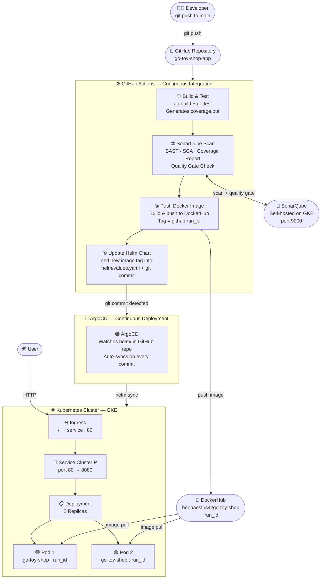

<div align="center">

# 🧸 Go Toy Shop


### End-to-End DevOps Project

*A production-grade Go web application with automated CI/CD pipeline using GitHub Actions, SonarQube, Docker, Helm, and ArgoCD on Kubernetes*

<br/>

[](https://golang.org)
[](https://hub.docker.com/r/hephaestus4i/go-toy-shop)
[](https://kubernetes.io)
[](https://helm.sh)
[](https://github.com/Amands123/go-toy-shop-app/actions)
[](https://argo-cd.readthedocs.io)
[](https://www.sonarsource.com)

</div>

---

## 📑 Table of Contents

- [CI/CD Architecture](#-cicd-architecture)
- [Project Structure](#-project-structure)
- [Prerequisites](#-prerequisites)
  - [Install ArgoCD](#-install-argocd)
  - [Install SonarQube](#-install-sonarqube)
- [CI Pipeline — GitHub Actions](#-ci-pipeline--github-actions)
- [CD Pipeline — ArgoCD](#-cd-pipeline--argocd)
- [Local Development](#-local-development)
- [Application Routes](#-application-routes)

---

## 🏗️ CI/CD Architecture



---

## 📁 Project Structure

```
go-toy-shop-app/
│
├── main.go                          # HTTP server & route registration
├── main_test.go                     # Handler tests
├── go.mod                           # Go module (v1.24)
│
├── handlers/
│   └── handlers.go                  # Request handlers & in-memory data
│
├── templates/                       # HTML templates
│   ├── home.html
│   ├── toys.html
│   ├── cart.html
│   ├── order-success.html
│   ├── about.html
│   └── contact.html
│
├── static/                          # CSS & images
│
├── Dockerfile                       # Multi-stage: golang:1.24 → distroless
├── sonar-project.properties         # SonarQube project config
│
├── helm/
│   └── go-toy-shop-chart/
│       ├── Chart.yaml
│       ├── values.yaml              # ← image.tag auto-updated by CI
│       └── templates/
│           ├── deployment.yaml
│           ├── service.yaml
│           └── ingress.yaml
│
├── k8s/manifests/                   # Raw Kubernetes manifests
│   ├── deployment.yaml
│   ├── service.yaml
│   └── ingress.yaml
│
└── .github/
    └── workflows/
        └── ci.yaml                  # GitHub Actions CI pipeline
```

---

## ✅ Prerequisites

Before running the CI/CD pipeline, the following must already be set up on your cluster:

| Requirement | Status |
|---|---|
| GKE Cluster (or any K8s cluster) | Must be running |
| `kubectl` configured | Must point to your cluster |
| `helm` v3 installed | Required for chart installs |
| ArgoCD installed on cluster | See steps below |
| SonarQube installed on cluster | See steps below |

---

## 🟠 Install ArgoCD

```bash
# 1. Create namespace
kubectl create namespace argocd

# 2. Install ArgoCD
kubectl apply -n argocd -f https://raw.githubusercontent.com/argoproj/argo-cd/stable/manifests/install.yaml

# 3. Expose ArgoCD UI externally
kubectl patch svc argocd-server -n argocd -p '{"spec": {"type": "LoadBalancer"}}'

# 4. Get external IP  (wait ~30s for IP to be assigned)
kubectl get svc argocd-server -n argocd

# 5. Get admin password
kubectl -n argocd get secret argocd-initial-admin-secret \
  -o jsonpath="{.data.password}" | base64 -d; echo
```

> 🌐 Access UI at `http://<EXTERNAL-IP>` &nbsp;|&nbsp; Login: `admin` / `<password from step 5>`

---

### Configure ArgoCD to watch your Helm chart

Create `argocd-app.yaml` at the root of your repo:

```yaml
apiVersion: argoproj.io/v1alpha1
kind: Application
metadata:
  name: go-toy-shop
  namespace: argocd
spec:
  project: default
  source:
    repoURL: https://github.com/Amands123/go-toy-shop-app.git
    targetRevision: main
    path: helm/go-toy-shop-chart
  destination:
    server: https://kubernetes.default.svc
    namespace: default
  syncPolicy:
    automated:
      prune: true
      selfHeal: true
```

```bash
kubectl apply -f argocd-app.yaml
```

> ArgoCD now watches `helm/go-toy-shop-chart/` and **auto-syncs every time CI commits a new image tag** into `values.yaml`

---

## 🔵 Install SonarQube

```bash
# 1. Create namespace
kubectl create namespace sonarqube

# 2. Add SonarQube Helm repo
helm repo add sonarqube https://SonarSource.github.io/helm-chart-sonarqube
helm repo update

# 3. Install SonarQube (Community Edition)
helm install sonarqube sonarqube/sonarqube -n sonarqube \
  --set monitoringPasscode="admin123" \
  --set community.enabled=true

# 4. Wait until pod is Running  (takes 2-3 mins due to Elasticsearch)
kubectl get pods -n sonarqube -w

# 5. Expose SonarQube UI externally
kubectl patch svc sonarqube-sonarqube -n sonarqube -p '{"spec": {"type": "LoadBalancer"}}'

# 6. Get external IP
kubectl get svc sonarqube-sonarqube -n sonarqube
```

> 🌐 Access UI at `http://<EXTERNAL-IP>:9000` &nbsp;|&nbsp; Login: `admin` / `admin` *(you'll be prompted to change it)*

---

### Generate SonarQube token for CI

```
1. Login → My Account → Security
2. Generate Token → name it "github-actions"
3. Copy the token
```

Add `sonar-project.properties` at repo root:

```properties
sonar.projectKey=go-toy-shop-app
sonar.projectName=Go Toy Shop
sonar.sources=.
sonar.exclusions=**/vendor/**,**/*_test.go
sonar.tests=.
sonar.test.inclusions=**/*_test.go
sonar.go.coverage.reportPaths=coverage.out
sonar.language=go
```

---

## ⚙️ CI Pipeline — GitHub Actions

> Triggered on every push to `main` — ignores changes to `helm/`, `k8s/`, `README.md`

```
push to main
    │
    ▼
① build           ─── go mod tidy → go build → go test -coverprofile=coverage.out
    │                  Uploads coverage.out as artifact
    ▼
② code-quality    ─── Downloads coverage.out
    │                  Runs SonarQube scan against self-hosted SonarQube
    │                  Quality Gate must PASS to continue
    ▼
③ push            ─── Docker build (multi-stage → distroless)
    │                  Push to DockerHub: hephaestus4i/go-toy-shop:<github.run_id>
    ▼
④ update-helm     ─── sed image tag into helm/go-toy-shop-chart/values.yaml
                       git commit & push → triggers ArgoCD sync
```

### Pipeline job dependency

| Job | Needs | Runs on |
|---|---|---|
| `build` | — | every push |
| `code-quality` | `build` | every push |
| `push` | `code-quality` ✅ quality gate | every push |
| `update-newtag-in-helm-chart` | `push` | every push |

> 🔒 Docker image is only published if **SonarQube quality gate passes**

### Required GitHub Secrets

| Secret | Where to get it |
|---|---|
| `SONAR_TOKEN` | SonarQube → My Account → Security → Generate Token |
| `SONAR_HOST_URL` | `http://<sonarqube-external-ip>:9000` |
| `DOCKERHUB_USERNAME` | Your DockerHub username |
| `DOCKERHUB_TOKEN` | DockerHub → Account Settings → Security |
| `TOKEN` | GitHub → Settings → Developer Settings → Personal Access Token |

---

## 🔄 CD Pipeline — ArgoCD

ArgoCD is the only CD mechanism — **no `helm upgrade` in the CI pipeline**.

```
CI commits new image tag to helm/values.yaml
            │
            ▼
ArgoCD detects change in repo  (polls every 3 minutes)
            │
            ▼
ArgoCD runs helm sync → Kubernetes rolling update
            │
            ▼
New pods pull updated image from DockerHub
Old pods terminated after new pods are healthy
```

### Monitor deployments

```bash
# Watch ArgoCD sync status
kubectl get applications -n argocd

# Watch pod rollout
kubectl get pods -w

# Check current image tag running
kubectl describe pod -l app=go-toy-shop | grep Image
```

---

## 💻 Local Development

```bash
# Clone
git clone https://github.com/Amands123/go-toy-shop-app.git
cd go-toy-shop-app

# Run
go mod tidy
go run main.go
# → http://localhost:8080

# Test
go test ./... -v
go test ./... -cover

# Build Docker image
docker build -t go-toy-shop:local .
docker run -p 8080:8080 go-toy-shop:local
```

---

## 🛣️ Application Routes

| Method | Route | Description |
|---|---|---|
| `GET` | `/` | Home — toy categories |
| `GET` | `/toys?category=<name>` | Products by category |
| `GET` | `/add-to-cart?id=<id>` | Add item to cart |
| `GET` | `/cart` | View cart |
| `POST` | `/place-order` | Place order |
| `GET` | `/about` | About page |
| `GET` | `/contact` | Contact page |

---

<div align="center">

**Made with ❤️ by [Aman Agarwal](https://github.com/Amands123)**

</div>
